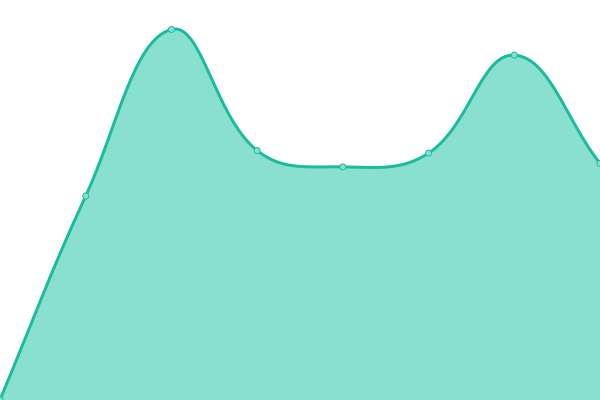

# [📈 Live Status](https://damipoo.github.io/legendary-pancake): <!--live status--> **🟧 Partial outage**

This repository contains the open-source uptime monitor and status page for [Damian Martinez Gelabert](https://damipoo.github.io/legendary-pancake), powered by [Upptime](https://github.com/upptime/upptime).

With [Upptime](https://upptime.js.org), you can get your own unlimited and free uptime monitor and status page, powered entirely by a GitHub repository. We use [Issues](https://github.com/damipoo/legendary-pancake/issues) as incident reports, [Actions](https://github.com/damipoo/legendary-pancake/actions) as uptime monitors, and [Pages](https://damipoo.github.io/legendary-pancake) for the status page.

<!--start: status pages-->
<!-- This summary is generated by Upptime (https://github.com/upptime/upptime) -->
<!-- Do not edit this manually, your changes will be overwritten -->
<!-- prettier-ignore -->
| URL | Status | History | Response Time | Uptime |
| --- | ------ | ------- | ------------- | ------ |
|  [Main site](https://www.huesped.org.ar) | 🟩 Up | [main-site.yml](https://github.com/damipoo/legendary-pancake/commits/HEAD/history/main-site.yml) | 

 1487ms
     
 | 

<a href="https://damipoo.github.io/legendary-pancake/history/main-site">100.00%</a>
    

|  [Donde - STG](https://stg.donde.huesped.org.ar/) | 🟩 Up | [donde-stg.yml](https://github.com/damipoo/legendary-pancake/commits/HEAD/history/donde-stg.yml) | 

 298ms
     
 | 

<a href="https://damipoo.github.io/legendary-pancake/history/donde-stg">100.00%</a>
    

|  [ORG redirect](https://www.huesped.org) | 🟥 Down | [org-redirect.yml](https://github.com/damipoo/legendary-pancake/commits/HEAD/history/org-redirect.yml) | 

 0ms
     
 | 

<a href="https://damipoo.github.io/legendary-pancake/history/org-redirect">0.00%</a>
    

<!--end: status pages-->

[**Visit our status website →**](https://damipoo.github.io/legendary-pancake)

## 📄 License

- Powered by: [Upptime](https://github.com/upptime/upptime)
- Code: [MIT](./LICENSE) © [Anand Chowdhary](https://anandchowdhary.com), supported by [Pabio](https://pabio.com)
- Data in the `./history` directory: [Open Database License](https://opendatacommons.org/licenses/odbl/1-0/)
